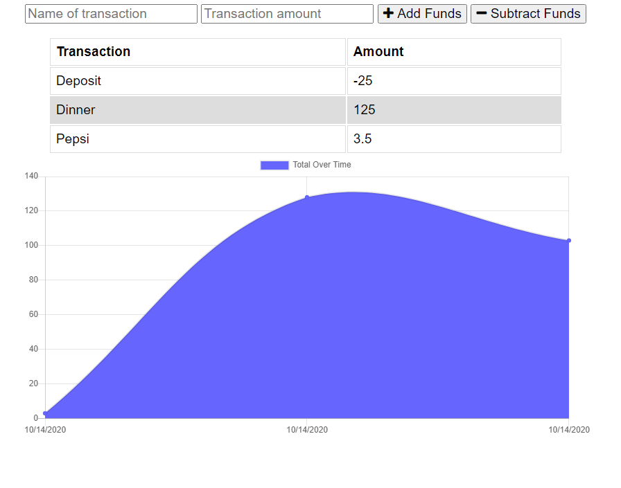

## This is unit 18 PWA homework: Budget Tracker Application

## Application URL

My code can be found at [Budget Tracker](https://sheldonmall.github.io/budget-tracker/) 

## Description

This is a budget tracking app using Node.js, Express.js, MongoDB, Heroku and Mongoose. Majority of the front end code was provided in a homework as part of a web development boot camp. Allows the user to track their expenses and save them in a database. This is a progressive web app (PWA) where transactions are cached for offline use. 

The front-end was already provided and only server, routes, service-worker and manifest had to be added.

## Installation

* Please run `npm i express morgan mongoose compression` to install the dependancies before you execute this application.

## Usage 

Execute the application by giving the following command on the command line:
`$npm start`.

* The application will prompt to add or subtract `funds`. A log of the fund transaction is shown below on the screen.

My Task list for developing this application are as follows:

[x] Building the application

[x] Running Tests 

[X] Fully functional

[ ] User testing

[ ] User feedback 

## Credits

I have made use of class activities and re-purposed code from 26-Stu-Mini-Project activity to create this app. 

## Contributing

I invite and would welcome contributions and ideas. Please contribute to the application at https://github.com/sheldonmall/

## License

There is no need for any license at the moment to use my application.

---

## Tests

The applications is fully functional. Please test it for different roles and options.
